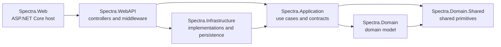

# Spectra Solution Overview

**Repository:** Spectra
**Solution:** `SpectraWorkspace.sln`
**Target runtime:** .NET 10 (`global.json` pins SDK `10.0.400-preview.0.26322.102`, rolling forward to the latest feature band)
**Document scope:** Solution and source inventory reviewed on 2026-09-15

## 1. Product and Architecture Summary

Spectra is a healthcare-oriented platform exposed through ASP.NET Core APIs. Its application surface includes clients, patients, employees and medical staff, countries and locations, medical master data, documents and attachments, notifications, settings, contracts, chats, templates, and identity/permission management.

The solution follows a Clean Architecture-inspired split:

- **Domain Shared** contains cross-cutting primitives, constants, enums, exceptions, options, helpers, and result wrappers.
- **Domain** contains business entities, value objects, domain contracts, enumerations, and domain-facing abstractions. It depends only on Domain Shared among solution projects.
- **Application** contains use cases, commands, queries, DTOs, validators, application interfaces, services, MediatR handlers, pipeline behaviors, and seeders. It depends on Domain and Domain Shared.
- **Infrastructure** implements persistence, repositories, external services, identity services, email, SignalR, templates, seeding, and integrations. It depends on Application, Domain, and Domain Shared.
- **WebAPI** contains HTTP-facing controllers, areas, middleware, filters, and current-user plumbing. Its project references connect the API surface to the application and infrastructure layers.
- **Web** is the main ASP.NET Core host. It composes the API, application, and infrastructure registrations, configures middleware, JSON, CORS, Swagger, Serilog, and client-side settings.
- The application currently uses ASP.NET Core Identity with JWT authentication, not a separate IdentityServer host.

### Dependency direction

The project references implement the core direction explicitly. `Spectra.Web` references `Spectra.WebAPI`; `Spectra.WebAPI` references Application, Domain, Domain Shared, and Infrastructure; Infrastructure references Application, Domain, and Domain Shared; Application references Domain and Domain Shared; and Domain references Domain Shared.

## 2. Solution Projects

| Project | Role | Main source areas | C# files* |
|---|---|---|---:|
| `Spectra.Domain.Shared` | Shared kernel and cross-cutting contracts | `Common`, `Constants`, `Enums`, `GlobalExceptions`, `Helpers`, `OptionDtos`, `Wrappers` | 64 |
| `Spectra.Domain` | Domain model and business abstractions | `AppRole`, `AppUser`, `Chats`, `Clients`, `Common`, `Contracts`, `Countries`, `Documents`, `Employees`, `Enumeration`, `MasterData`, `Notifications`, `Patients`, `Payment`, `Sessions`, `Settings`, `StaticStringDatas`, `ValueObjects` | 131 |
| `Spectra.Application` | Use cases and application orchestration | `AppRoles`, `AppUsers`, `Behavior`, `Chats`, `Clients`, `Commons`, `Contracts`, `Countries`, `Documents`, `Employees`, `Hellper`, `Identities`, `Interfaces`, `MasterData`, `Messaging`, `Notifications`, `Patients`, `Settings`, `StaticStringDatas`, `Templates`, `Validator` | 311 |
| `Spectra.Infrastructure` | Adapters and technical implementations | `Chats`, `Clients`, `Contracts`, `Countries`, `Data`, `Documents`, `EmailSenders`, `Employees`, `Handlers`, `MasterData`, `Migrations`, `Notifications`, `Patients`, `Repositories`, `Services`, `Settings`, `StaticStringDatas`, `Templates` | 71 |
| `Spectra.WebAPI` | API transport layer | `Areas`, `Controllers`, `Middlewares` | 52 |
| `Spectra.Web` | Main API host and web composition root | `CustomFilters`, `Extensions`, `Models`, `Properties`, `ClientApp`, configuration files | 5 |

\* Counts are the number of `.cs` files found recursively under each project directory during this review. They are an inventory signal, not a generated API reference.

## 3. Main Business Modules

The same business concepts are intentionally represented across layers: domain entities and contracts, application use cases and DTOs, infrastructure services/repositories, and API endpoints.

| Module | Responsibilities represented in the source tree |
|---|---|
| **Identity and access** | Users, roles, authentication, JWT tokens, role permissions, permission groups/categories, authorization policies, profile management, password and account operations |
| **Clients and patients** | Client registration and maintenance, patient records, patient-facing workflows, user profiles and attachments |
| **Employees and medical staff** | Employee groups, medical staff, contracts, specialties, departments, role-aware operations |
| **Medical master data** | Diagnoses, drugs, general complaints, internal examinations, medical tests/X-rays, sections, services, specializations, treatment-related data, Excel upload processing |
| **Countries and locations** | Countries, states, cities, external CountriesNow configuration and seed services |
| **Documents and templates** | Document storage/metadata, images and attachments, Razor templates, PDF generation, Word/OpenXML and spreadsheet processing |
| **Chats and notifications** | Chat services, SignalR registration, notification services and related handlers |
| **Settings and static data** | Application settings, medical specialties, static string data, templates and seed operations |
| **Integrations** | SMTP email, SNOMED terminology lookup, MongoDB services, HTTP clients, IdentityServer clients, and Azure identity support in the auth host |

## 4. Runtime Composition

### Main API host

`Spectra.Web/Program.cs` creates the `WebApplicationBuilder`, loads the environment-specific `appsettings` file and environment variables, configures Serilog from configuration, invokes `ConfigureWebHost`, builds the app, runs `SetupMiddlewares`, and starts the host.

`Spectra.Web/DependencyInjection.cs` composes the application through these registrations:

1. MVC controllers with Newtonsoft.Json and reference-loop handling.
2. Application registrations, including FluentValidation, MediatR handlers and pipeline behaviors, Mapster scanning, RazorLight, and PDF conversion.
3. Infrastructure registrations, including repositories, application services, authentication, Identity, EF Core, email, SignalR, data protection, and SNOMED.
4. WebAPI registrations, including `ICurrentUser` and `CurrentUserHandler`.
5. Swagger/OpenAPI with JWT Bearer security metadata.
6. CORS from `AllowedCorsOrigins` and keyed client-side settings from `Clients`.

### Application pipeline

MediatR is registered from the Application assembly with these cross-cutting behaviors:

- `LoggingBehavior`
- `ExceptionHandlingBehavior`
- `ValidationBehavior`
- `EventDispatcherBehavior`

This gives command/query handlers a consistent place for logging, validation, exception translation, and domain-event dispatching.

### API surface

The API is organized primarily with ASP.NET Core Areas and controller bases:

- **Public:** authentication and registration workflows, including login, client registration, medical-provider registration, password recovery, and password reset.
- **User:** authenticated profile, authentication information, attachments, employee groups, and related user operations.
- **Client:** client CRUD endpoints are represented by `ClientController` and `IClientService`.
- **Admin:** system-admin-protected controllers inherit from `AdminBaseController` and use the `api/[area]/[controller]` route convention.
- **Controllers and middleware:** shared API controllers, permission setup, current-user resolution, and request pipeline concerns.

The public route convention uses `api/[area]/[controller]` where area controllers define their own routes. Swagger is exposed as `Spectra APIs` version `v1` and is configured for Bearer JWT authentication.

## 5. Persistence and External Systems

### Main application data

- Entity Framework Core 8 is used with PostgreSQL through `Npgsql.EntityFrameworkCore.PostgreSQL`.
- `Spectra.Infrastructure.Data.IdentityContext` derives from `IdentityDbContext<AppUser, AppRole, string>`.
- The context includes ASP.NET Identity tables plus `DataProtectionKeys`, `RolePermissions`, `PermissionGroups`, `PermissoinCategories`, `Permissions`, and `UserImages`.
- `Spectra.Infrastructure/Migrations` contains PostgreSQL migrations, including the initial schema and auditing changes.
- MongoDB is also registered through `MongoDbService` and a generic `IBaseMongoDbRepository<>` implementation for document-oriented access.

### Current authentication model

The active application authenticates with ASP.NET Core Identity and JWT bearer tokens configured in the infrastructure layer. The relevant authentication setup is registered in `Spectra.Infrastructure/DependencyInjection.cs`, where the app configures `JwtBearerDefaults.AuthenticationScheme`, `AddIdentityCore<AppUser>()`, and `AddEntityFrameworkStores<IdentityContext>()`.

This means the running application is currently self-contained and does not rely on a separate IdentityServer host for token issuance.

### Integrations

- SMTP email through FluentEmail and Razor rendering.
- SNOMED CT terminology lookup via an `HttpClient` configured for `browser.ihtsdotools.org`.
- SignalR for real-time communication and a custom user ID provider.
- DinkToPdf, RazorLight, OpenXML, EPPlus, ImageSharp, NAudio, and LAME for document, media, image, audio, and export workflows.
- Serilog console and PostgreSQL sinks for structured logging.

## 6. Authentication and Authorization

The main API configures JWT Bearer authentication from `Jwt:Issuer`, `Jwt:Audience`, and `Jwt:Key`. It also supports token extraction for SignalR hub requests through the `access_token` query parameter and a general `token` query parameter.

ASP.NET Core Identity is configured with `AppUser` and `AppRole`, backed by `IdentityContext`. Role and permission services implement:

- User creation, lookup, role membership, password/email operations, and token workflows.
- Permission groups, categories, permissions, role permissions, and access levels.
- Permission contributor discovery through reflection and permission seeding.
- Role and permission lookup for authenticated users.

`IdentitySeeder` creates permission metadata, synchronizes role permissions, and provisions the configured initial administrator. Review deployment configuration before using seeded credentials in any non-development environment.

The separate IdentityServer host uses IdentityServer4 with JWT, OpenID Connect, Google, and Twitter authentication package support, plus its own configuration models and seed service.

## 7. Technical Stack

| Area | Technologies found in project files |
|---|---|
| Runtime | .NET 8, ASP.NET Core, C# nullable reference types, implicit usings |
| Web/API | ASP.NET Core MVC/Web API, Areas, Newtonsoft.Json, Swagger/Swashbuckle, Scalar.AspNetCore |
| Application patterns | MediatR, CQRS-style commands/queries, FluentValidation, pipeline behaviors, Mapster |
| Domain | Entity/value-object model, domain events, shared result wrappers, custom exceptions, ASP.NET Identity types |
| Persistence | Entity Framework Core 8, PostgreSQL/Npgsql, MongoDB.Driver, MongoDB.EntityFrameworkCore |
| Authentication | ASP.NET Core Identity, JWT Bearer, role/permission authorization |
| Messaging/realtime | MediatR and SignalR |
| Logging | Serilog, console sink, PostgreSQL sink, Serilog.AspNetCore |
| Documents/media | DinkToPdf, RazorLight, DocumentFormat.OpenXml, EPPlus, ImageSharp, NAudio, NAudio.Lame, MimeTypesMap |
| Email | FluentEmail Core, Razor, and SMTP providers |
| HTTP/integrations | `HttpClient`, Flurl/Flurl.Http, Azure.Identity, SNOMED CT HTTP integration |
| API documentation | XML documentation generation configuration, Swashbuckle/OpenAPI, Scalar |

## 8. Configuration and Deployment Notes

Configuration is split by environment:

- `Spectra.Web` contains Development, Staging, Production, and base settings files.
- Environment variables are added by the main Web host at startup.
- Connection strings and authentication material are expected to be supplied through host configuration. Secrets should not be committed to source-controlled settings.
- `Spectra.Web` embeds `libwkhtmltox.dll` for PDF functionality.
- `azure-pipelines.yml` is present at the solution root for CI/CD integration.

## 9. Codebase Conventions

- Dependency injection is grouped into project-level extension classes named `DependencyInjection`.
- Application abstractions live in Application contracts/interfaces; Infrastructure supplies concrete implementations.
- API controllers use constructor injection and commonly delegate work to MediatR or application services.
- Results are commonly returned through `OperationResult`/wrapper types and mapped to HTTP responses in controllers.
- Identity and permission setup relies partly on assembly scanning and reflection-based contributors.
- Migrations are kept beside the infrastructure/auth hosts that own their respective database contexts.
- Naming is not completely uniform (`Hellper`, `Permissoin`, and several `Memeber`/`Attchment` identifiers are present); new code should follow the established public names unless a coordinated rename is intended.

## 10. Source Inventory and Boundaries

The review found **676 C# files** across the six active solution projects. The counts include application, domain, infrastructure, host, controller, migration, and support classes. They do not include JavaScript, Razor, HTML, JSON, XML, binaries, generated build output, or static assets.

The solution root also contains the following non-project artifacts relevant to build and maintenance:

- `SpectraWorkspace.sln`
- `global.json`
- `azure-pipelines.yml`
- `.editorconfig`

This document is an architectural overview and source inventory. For endpoint-level contracts, use the controller and DTO definitions under `Spectra.WebAPI` and `Spectra.Application`; for database details, use the corresponding migration folders and DbContext configuration.